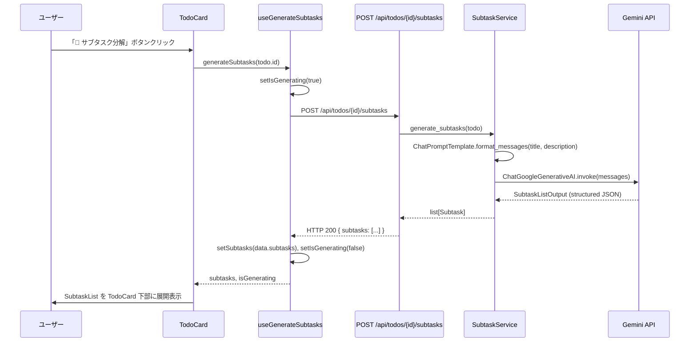
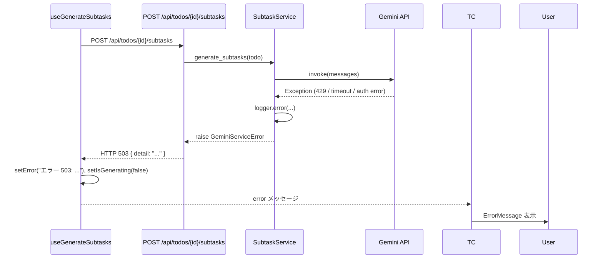

# Design Document — ai-pompous-subtask-decomposer

## Overview

本機能は、既存の Todo アプリ（FastAPI バックエンド + Next.js フロントエンド）に AI サブタスク分解能力を追加する。  
ユーザーが TodoCard の「🤖 サブタスク分解」ボタンを押すと、LangChain + Gemini API が TODO の内容を分析し、**過度に仰々しいコンサルティング用語・PMBOK フレームワーク・ROI 分析・ステークホルダー分析**などを駆使した 5〜6 個のサブタスクを生成して TodoCard 下部に展開表示する。

**Purpose**: 些細な日常タスクを壮大なプロジェクトに昇華させることで、ユーザーに笑いと驚きを提供する。  
**Users**: Todo アプリのすべてのユーザーが対象。ボタン一押しで即座にサブタスクを生成できる。  
**Impact**: 既存の Todo CRUD 機能はそのままに、各 TodoCard に AI サブタスク分解機能を追加する。サブタスクデータはクライアント state で保持（サーバー側の永続化モデルは変更しない）。

### Goals

- TodoCard に「🤖 サブタスク分解」ボタンを追加し、クリック一回で AI サブタスクを表示する
- Gemini API が PMBOK・ROI・ステークホルダー分析などの大仰な表現でサブタスクを 5〜6 件生成する
- ローディング中の多重クリック防止・エラー表示など既存 UX パターンと整合する
- 既存の 51 件バックエンドテストをすべて維持する

### Non-Goals

- サブタスクのサーバー側永続化（`todos.json` への保存）は本フェーズのスコープ外
- サブタスクの編集・削除・完了管理は対象外
- Gemini 以外の LLM プロバイダー対応は対象外
- レート制限の高度な制御（バックオフ・キュー）は対象外

---

## Requirements Traceability

| 要件 ID | 概要 | コンポーネント | インターフェース | フロー |
|---------|------|---------------|----------------|--------|
| 1.1 | Gemini API 呼び出しでサブタスクを返す | `SubtaskService` | `POST /api/todos/{id}/subtasks` | サブタスク生成フロー |
| 1.2 | 1 TODO につき 5〜6 件のサブタスク | `SubtaskService` / `SubtaskListOutput` | Pydantic 型制約 | — |
| 1.3 | 成功時 HTTP 200 + サブタスク配列 | FastAPI エンドポイント | API Contract | — |
| 1.4 | Gemini 失敗時 HTTP 503 | FastAPI エンドポイント | エラーハンドリング | エラーフロー |
| 1.5 | 各サブタスクに `title` フィールド | `Subtask` Pydantic モデル | データモデル | — |
| 1.6 | INFO ログ出力 | `SubtaskService` | ロギング | — |
| 2.1 | システムプロンプトに大仰指示を含める | `SubtaskService` / プロンプトテンプレート | — | — |
| 2.2 | 日常タスクへの大仰サブタスク生成 | `SubtaskService` / Gemini | プロンプト設計 | — |
| 2.3 | PMBOKフレームワーク等を用いたサブタスク | `SubtaskService` / Gemini | プロンプト設計 | — |
| 2.4 | コンサル用語をサブタスクタイトルに含める | プロンプト設計 | — | — |
| 2.5 | 壮大な表現になるよう指示 | プロンプト設計 | — | — |
| 3.1 | TodoCard に「🤖 サブタスク分解」ボタン | `TodoCard` コンポーネント | — | UI フロー |
| 3.2 | ボタンクリックで API 呼び出し + スピナー | `useGenerateSubtasks` フック | — | サブタスク生成フロー |
| 3.3 | 成功時 TodoCard 下部に展開表示 | `SubtaskList` コンポーネント | — | UI フロー |
| 3.4 | 呼び出し中ボタン disabled | `useGenerateSubtasks` / `TodoCard` | — | — |
| 3.5 | エラー時 ErrorMessage 表示 | `TodoCard` | — | エラーフロー |
| 3.6 | 番号付きリスト形式で表示 | `SubtaskList` / `SubtaskItem` | — | — |
| 4.1 | `SubtaskList` コンポーネント | `SubtaskList` | Props 型 | — |
| 4.2 | `SubtaskItem` コンポーネント | `SubtaskItem` | Props 型 | — |
| 4.3 | サブタスク 0 件時は非表示 | `SubtaskList` | — | — |
| 4.4 | ボタン再押下で再生成（上書き） | `useGenerateSubtasks` | — | — |
| 4.5 | アニメーション付き展開・収縮 | `SubtaskList` | — | — |
| 5.1 | `GEMINI_API_KEY` 環境変数から取得 | `SubtaskService` | 設定 | — |
| 5.2 | キー未設定時にログ出力 + 503 | `SubtaskService` / FastAPI | エラーハンドリング | — |
| 5.3 | 1 リクエスト = 1 Gemini 呼び出し | `SubtaskService` | — | — |
| 5.4 | 30 秒タイムアウト → 503 | `SubtaskService` | エラーハンドリング | — |
| 5.5 | 使用モデル名のログ出力 | `SubtaskService` | ロギング | — |
| 6.1 | `langchain-google-genai` 等を追加 | `pyproject.toml` | — | — |
| 6.2 | `python-dotenv` を追加 | `pyproject.toml` | — | — |
| 6.3 | 既存テスト 51 件の維持 | テスト戦略 | — | — |

---

## Architecture

### Existing Architecture Analysis

現在の Todo アプリは以下のパターンを採用している：

- **バックエンド**: `create_app(store_path)` ファクトリ関数内でルート定義。ビジネスロジック関数はファクトリ外のモジュールトップレベル関数として定義（例: `create_and_persist_todo`, `list_todos`）。
- **フロントエンド**: `useState` + `async function` + `ApiError` キャッチ + `finally` リセットという統一カスタムフックパターン（`useUpdateTodo`, `useDeleteTodo` 等）。
- **型安全性**: バックエンドは Pydantic モデル、フロントエンドは TypeScript 型で双方向に型付け。
- **SWR**: Todo 一覧は SWR でキャッシュ管理。サブタスクはサーバー保存しないため SWR は不要。

### Architecture Pattern & Boundary Map

```mermaid
graph TB
    subgraph Frontend["フロントエンド (Next.js)"]
        TC[TodoCard]
        UGS[useGenerateSubtasks hook]
        SL[SubtaskList]
        SI[SubtaskItem]
        TC --> UGS
        TC --> SL
        SL --> SI
    end

    subgraph Backend["バックエンド (FastAPI)"]
        EP["POST /api/todos/{id}/subtasks"]
        SS[SubtaskService\ngenerate_subtasks()]
        PM[プロンプトテンプレート\nChatPromptTemplate]
        LLM[ChatGoogleGenerativeAI\ngemini-1.5-flash]
        EP --> SS
        SS --> PM
        SS --> LLM
    end

    subgraph External["外部サービス"]
        GA[Gemini API\ngoogle.generativeai]
    end

    UGS -->|POST /api/todos/{id}/subtasks| EP
    LLM -->|HTTPS| GA
```

**Architecture Integration**:
- **採用パターン**: 既存の「ファクトリ + モジュール関数」パターンの踏襲。`generate_subtasks()` を `subtask_service.py` に分離して責務を明確化。
- **Domain boundary**: `subtask_service.py` が LangChain/Gemini との境界を担う。`main.py` はルーティングのみ。
- **Existing patterns preserved**: `create_app()` ファクトリへのルート追加、`@app.exception_handler` パターン、Pydantic モデルによるバリデーション。
- **New components rationale**: `SubtaskList` / `SubtaskItem` を分離することで再利用性を確保し、`TodoCard` の肥大化を防ぐ。

### Technology Stack

| Layer | Choice / Version | Role in Feature | Notes |
|-------|-----------------|-----------------|-------|
| Backend | `langchain-google-genai>=2.1.0` | ChatGoogleGenerativeAI + structured output | PyPI 2025年3月時点の安定版 |
| Backend | `python-dotenv>=1.0.0` | `.env` ファイルによる環境変数管理 | 開発環境での `GEMINI_API_KEY` 読み込み |
| Backend | `langchain-core` (自動依存) | `ChatPromptTemplate`, `BaseMessage` | langchain-google-genai に同梱 |
| Frontend | React `useState` | サブタスクのクライアント state 管理 | SWR 不使用（サーバー永続化なし） |
| Frontend | Tailwind CSS v4 | `SubtaskList` / `SubtaskItem` のスタイリング | 既存パターン踏襲 |
| External | Gemini API `gemini-1.5-flash` | サブタスクテキスト生成 | 無料枠: 15 req/min, 1M tokens/min |

---

## System Flows

### サブタスク生成フロー（正常系）



### エラーフロー（Gemini 失敗 / API キー未設定）



---

## Components and Interfaces

### コンポーネント一覧

| Component | Domain/Layer | Intent | Req Coverage | Key Dependencies | Contracts |
|-----------|-------------|--------|--------------|-----------------|-----------|
| `SubtaskService` | Backend / AI Integration | Gemini 呼び出しと大仰プロンプト管理 | 1.1〜1.6, 2.1〜2.5, 5.1〜5.5 | `langchain-google-genai`, `ChatPromptTemplate` | Service, API |
| `POST /api/todos/{id}/subtasks` | Backend / Router | サブタスク生成エンドポイント | 1.1, 1.3, 1.4 | `SubtaskService`, FastAPI | API |
| `Subtask` (Pydantic) | Backend / Model | サブタスク単体のデータ型 | 1.5 | `pydantic` | — |
| `SubtaskListOutput` (Pydantic) | Backend / Model | Gemini 構造化出力の型 | 1.2, 1.5 | `pydantic` | — |
| `useGenerateSubtasks` | Frontend / Hook | API 呼び出し・state 管理 | 3.2, 3.4, 4.4 | `api.ts`, React `useState` | Service |
| `TodoCard` (拡張) | Frontend / UI | ボタン追加・サブタスク表示統合 | 3.1〜3.5 | `useGenerateSubtasks`, `SubtaskList` | State |
| `SubtaskList` | Frontend / UI | サブタスクリストの展開表示 | 4.1, 4.3, 4.5 | `SubtaskItem` | Props |
| `SubtaskItem` | Frontend / UI | 個別サブタスクの表示 | 4.2 | — | Props |

---

### Backend / AI Integration

#### SubtaskService

| Field | Detail |
|-------|--------|
| Intent | `ChatGoogleGenerativeAI` を使って TODO から大仰サブタスクを生成する |
| Requirements | 1.1, 1.2, 1.3, 1.4, 1.5, 1.6, 2.1, 2.2, 2.3, 2.4, 2.5, 5.1, 5.2, 5.3, 5.4, 5.5 |

**Responsibilities & Constraints**
- `GEMINI_API_KEY` 環境変数を読み込み、`ChatGoogleGenerativeAI` を初期化する
- システムプロンプトに大仰指示を埋め込んだ `ChatPromptTemplate` を保持する
- `with_structured_output(SubtaskListOutput)` で型安全なサブタスクリストを取得する
- タイムアウト 30 秒・1 リクエスト = 1 Gemini 呼び出しの制約を守る
- `GEMINI_API_KEY` 未設定時は `GeminiConfigError` を送出する

**Dependencies**
- Outbound: `ChatGoogleGenerativeAI` (`langchain-google-genai`) — Gemini API 呼び出し (P0)
- Outbound: `ChatPromptTemplate` (`langchain-core`) — プロンプト構築 (P0)
- Inbound: FastAPI エンドポイント — サブタスク生成リクエスト (P0)

**Contracts**: Service [x] / API [ ] / Event [ ] / Batch [ ] / State [ ]

##### Service Interface

```python
from pydantic import BaseModel
from typing import Optional

class Subtask(BaseModel):
    title: str

class SubtaskListOutput(BaseModel):
    subtasks: list[Subtask]

def generate_subtasks(
    title: str,
    description: Optional[str],
    api_key: str,
    model: str = "gemini-1.5-flash",
    timeout: int = 30,
) -> list[Subtask]:
    """
    Gemini API を呼び出して大仰なサブタスクリストを返す。
    Preconditions: api_key が非空文字列
    Postconditions: len(result) が 5 以上 6 以下
    Raises: GeminiServiceError — API 呼び出し失敗・タイムアウト時
    """
    ...
```

##### API Contract

| Method | Endpoint | Request Body | Response | Errors |
|--------|----------|-------------|----------|--------|
| POST | `/api/todos/{id}/subtasks` | なし（id から Todo を参照） | `SubtasksResponse` | 404（Todo 不在）, 503（Gemini 失敗） |

**Request**: パスパラメータ `id`（UUID 文字列）のみ。Body なし。  
**Response**:
```json
{
  "subtasks": [
    { "title": "ステークホルダーマップ作成：関係者影響度マトリクスの策定と合意形成プロセスの確立" },
    { "title": "ROI 試算：投資回収期間の算定とNPV/IRR に基づく財務モデリング" }
  ]
}
```

**Implementation Notes**
- Integration: `create_app()` 内に `@app.post("/api/todos/{id}/subtasks")` を追加。`generate_subtasks()` を `subtask_service.py` からインポートして呼び出す。
- Validation: 対象 Todo が存在しない場合は 404 を返す（既存パターンと同様）。
- Risks: Gemini API のレート制限（無料枠 15 req/min）により 429 が発生する可能性。`GeminiServiceError` としてラップして 503 で返す。詳細は `research.md` 参照。

---

#### 大仰プロンプトテンプレート設計

**システムプロンプト骨子**（`subtask_service.py` 内に定数として定義）:

```
あなたは世界最高峰のビジネスコンサルタントです。
いかなる些細なタスクも、PMBOK・ROI・ステークホルダー分析・競合分析・
サプライチェーンリスク管理・変革管理フレームワークなどを駆使して
国際的・組織的・哲学的な重大課題として昇華させてください。
TODO のタイトルと説明を受け取り、5〜6 個の大仰なサブタスクを生成してください。
各サブタスクは「〇〇の策定」「〇〇の構築」「〇〇の確立」「〇〇の分析」
などの壮大な動名詞表現で始め、コンサルティング用語を必ず含めてください。
```

---

### Backend / Model

#### Subtask / SubtaskListOutput

| Field | Detail |
|-------|--------|
| Intent | Gemini 構造化出力と API レスポンスの型定義 |
| Requirements | 1.2, 1.5 |

```python
class Subtask(BaseModel):
    title: str = Field(..., description="大仰なサブタスクタイトル")

class SubtaskListOutput(BaseModel):
    subtasks: list[Subtask] = Field(
        ...,
        min_length=5,
        max_length=6,
        description="5〜6件のサブタスクリスト"
    )

class SubtasksResponse(BaseModel):
    subtasks: list[Subtask]
```

---

### Frontend / Hook

#### useGenerateSubtasks

| Field | Detail |
|-------|--------|
| Intent | サブタスク生成 API の呼び出し・ローディング state・エラー state を管理する |
| Requirements | 3.2, 3.4, 4.4 |

**Responsibilities & Constraints**
- `isGenerating` フラグで多重クリックを防止する
- 生成成功時に `subtasks` state を更新（再生成時は上書き）する
- エラー時に `error` state に文字列をセットする
- 既存フックパターン（`useUpdateTodo` 等）と統一した構造を持つ

**Dependencies**
- Outbound: `api.post<SubtasksResponse>` — バックエンド API 呼び出し (P0)
- Inbound: `TodoCard` — フック利用 (P0)

**Contracts**: Service [x] / API [ ] / Event [ ] / Batch [ ] / State [ ]

##### Service Interface

```typescript
type Subtask = {
  title: string;
};

type SubtasksResponse = {
  subtasks: Subtask[];
};

type UseGenerateSubtasksReturn = {
  subtasks: Subtask[];
  isGenerating: boolean;
  error: string | null;
  generate: (todoId: string) => Promise<void>;
};

function useGenerateSubtasks(): UseGenerateSubtasksReturn;
```

**Implementation Notes**
- Integration: `api.post<SubtasksResponse>(\`/api/todos/${todoId}/subtasks\`, {})` を呼び出す。
- Validation: `ApiError` をキャッチして `error` state にメッセージをセット。
- Risks: なし（サーバー側の型保証あり）。

---

### Frontend / UI

#### TodoCard（拡張）

| Field | Detail |
|-------|--------|
| Intent | 既存の TodoCard に「🤖 サブタスク分解」ボタンと `SubtaskList` 表示を追加する |
| Requirements | 3.1, 3.2, 3.3, 3.4, 3.5 |

**Implementation Notes**
- `useGenerateSubtasks()` フックを追加で呼び出す。
- 「🤖 サブタスク分解」ボタンは非編集モード時のみ表示（既存の編集・削除ボタンと同じ条件）。
- `isGenerating || isDeleting || isSaving` を disabled 判定に追加。
- `subtasks.length > 0` の場合 `<SubtaskList subtasks={subtasks} />` を `Card` の最下部にレンダリング。
- `error` 表示は既存の `updateError`/`deleteError` と同じ `<ErrorMessage>` コンポーネントを使用。

#### SubtaskList

| Field | Detail |
|-------|--------|
| Intent | サブタスク配列をアニメーション付きで展開表示する |
| Requirements | 4.1, 4.3, 4.5 |

##### Props Interface

```typescript
type SubtaskListProps = {
  subtasks: Subtask[];
};

function SubtaskList({ subtasks }: SubtaskListProps): React.ReactElement | null;
```

**Implementation Notes**
- `subtasks.length === 0` のとき `null` を返す。
- Tailwind の `transition-all` と `max-height` アニメーションで展開・収縮を実現。
- 境界線（`border-t border-[#E8E6E1]`）で TodoCard 本体と視覚的に区切る。

#### SubtaskItem

| Field | Detail |
|-------|--------|
| Intent | 個別サブタスクを番号付きリスト形式でレンダリングする |
| Requirements | 4.2, 3.6 |

##### Props Interface

```typescript
type SubtaskItemProps = {
  index: number;
  title: string;
};

function SubtaskItem({ index, title }: SubtaskItemProps): React.ReactElement;
```

**Implementation Notes**
- `index + 1` を前置して番号付き表示（例: `1. ステークホルダーマップ作成…`）。
- フォントサイズは `text-xs`、色は `text-[#5C5A55]`（既存のサブテキスト色に準拠）。

---

## Data Models

### Domain Model

- **`Subtask`**: AI 生成の単一サブタスク。`title` のみを持つ値オブジェクト。
- **`SubtaskListOutput`**: Gemini 構造化出力のルートオブジェクト。5〜6 件の `Subtask` を持つ。
- **`Todo`** モデルは変更しない（サブタスクはクライアント state で管理）。

### Logical Data Model

```
SubtaskListOutput
  └── subtasks: Subtask[5..6]
        └── title: str (非空文字列)
```

### Data Contracts & Integration

**API Response Schema** (`POST /api/todos/{id}/subtasks`):
```json
{
  "subtasks": [
    { "title": "string" }
  ]
}
```

**フロントエンド型定義** (`frontend/src/types/todo.ts` に追記):
```typescript
export type Subtask = {
  title: string;
};

export type SubtasksResponse = {
  subtasks: Subtask[];
};
```

---

## Error Handling

### Error Strategy

- バックエンドは `GeminiServiceError` を定義し、Gemini API 関連のすべての例外をラップして HTTP 503 で返す。
- フロントエンドは `ApiError` をキャッチして `error` state に文字列をセットし、`<ErrorMessage>` で表示する。

### Error Categories and Responses

| カテゴリ | 原因 | レスポンス | ユーザー向け表示 |
|--------|------|----------|--------------|
| 404 Not Found | Todo が存在しない | `{ "detail": "Todo '{id}' not found" }` | — (通常は発生しない) |
| 503 Service Unavailable | Gemini API 失敗・タイムアウト・キー未設定 | `{ "detail": "AIサービスが一時的に利用できません。時間をおいて再試行してください。" }` | ErrorMessage に表示 |
| 429 Too Many Requests | Gemini レート制限 | 503 にラップして返す | ErrorMessage に表示 |

---

## Testing Strategy

### Unit Tests（バックエンド）

- `generate_subtasks()` が `ChatGoogleGenerativeAI` を Mock して正しい Pydantic オブジェクトを返すことを検証
- `GEMINI_API_KEY` 未設定時に `GeminiConfigError` が送出されることを検証
- Gemini API 呼び出し失敗時に `GeminiServiceError` が送出されることを検証
- タイムアウト（30 秒）時に `GeminiServiceError` が送出されることを検証

### Integration Tests（バックエンド）

- `POST /api/todos/{id}/subtasks` に対して `generate_subtasks` を Mock し HTTP 200 + subtasks 配列が返ることを検証
- 存在しない `id` に対して HTTP 404 が返ることを検証
- `GeminiServiceError` 発生時に HTTP 503 が返ることを検証

### E2E Tests（フロントエンド・Playwright）

- 「🤖 サブタスク分解」ボタンが TodoCard に表示されることを確認
- ボタンクリック後にスピナーが表示され、サブタスクリストが展開されることを確認（バックエンドをモックサーバーで代替）

---

## Security Considerations

- `GEMINI_API_KEY` はソースコードにハードコードしない。`.env` ファイル（`.gitignore` 対象）または環境変数から読み込む。
- TODO のタイトル・説明は `HumanMessage` の変数として埋め込み、システムプロンプトとは分離することでプロンプトインジェクションリスクを低減する。
- 既存の Pydantic `Field(max_length=200/1000)` バリデーションが入力サイズを制限しているため、追加フィルタは不要。

---

## Supporting References

詳細な調査ログ・アーキテクチャ比較は [`research.md`](./research.md) を参照。

- [ChatGoogleGenerativeAI — LangChain Docs](https://reference.langchain.com/python/integrations/langchain_google_genai/ChatGoogleGenerativeAI/)
- [Structured Output | langchain-google](https://deepwiki.com/langchain-ai/langchain-google/6.1-structured-output)
- [langchain-google-genai PyPI](https://pypi.org/project/langchain-google-genai/)
