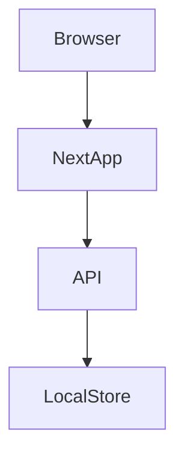

# Design: todo-app-fastapi-nextjs

## Overview
この機能は、ブラウザ上で利用できるシンプルな ToDo 管理体験（一覧参照・作成・更新・削除）を提供します。対象は個人ユースまたはプロトタイプ目的の開発者で、早期にユーザーバリデーションが可能なことを重視します。

### Goals
- 要求される CRUD 操作を安全に提供する API を設計する
- シンプルでテスト可能なローカル JSON 永続化戦略を定義する（プロトタイプ向け）
- Next.js フロントエンドから使いやすい API 契約を提供する

### Non-Goals
- マルチテナント認証/認可の実装
- 分散データベースやクラウド永続化の設計（必要なら別フェーズで検討）

## Architecture
簡潔な構成を採用します。コンポーネントはブラウザ（Next.js）、API サービス（FastAPI）、ローカル永続化（JSON ファイル）の 3 層です。



### Architecture Pattern & Boundary Map
- 選択パターン: 単一サービスアーキテクチャ（Frontend → Backend → LocalStore） — プロトタイプ/学習用途に適する単純さ
- 境界: UI 層（NextApp）は API 契約を通じてのみバックエンドへアクセス。永続化ロジックは API 層が所有する。

## Technology Stack

| Layer | Choice / Version | Role in Feature | Notes |
|-------|------------------|-----------------|-------|
| Frontend | Next.js (React) (推奨: 13+) | ユーザー操作と UI 表示 | CSR をベースに API 呼び出し（SWR/React Query 推奨）
| Backend | FastAPI (Python 3.11+) + Uvicorn | REST API 層 | 軽量で開発効率が高い
| Data / Storage | ローカル JSON ファイル | 永続化 | 原子書き込み戦略（テンポラリ→リネーム）を採用
| Infra / Runtime | Node.js, Python 実行環境 | 開発/デプロイ実行基盤 | 開発時はローカルで動作、後でコンテナ化可能

## Requirements Traceability
簡潔なマッピング（各要求の受け皿と対応コンポーネント）。

| Requirement | Summary | Components | Interfaces |
|-------------|---------|------------|------------|
| 1.1 | タスク作成の永続化 | API, LocalStore | POST /api/todos |
| 1.2 | タスク一覧取得 | API | GET /api/todos |
| 1.3 | タスク更新 | API, LocalStore | PUT /api/todos/{id} |
| 1.4 | タスク削除 | API, LocalStore | DELETE /api/todos/{id} |
| 2.1 | 書き込み時の整合性チェック | LocalStore, API | ローカル書き込み排他制御 |
| 2.2 | 破損検出と安全モード | API | エラー応答、バックアップ復元フロー |
| 2.3 | 同時アクセスの排他制御 | API, LocalStore | ファイルロック/原子書き込み |
| 3.1 | 入力バリデーション | API | スキーマ検証 (Pydantic) |
| 3.2 | 404 for missing resources | API | 404 応答設計 |
| 3.3 | 適切な HTTP ステータス | API | 201/200/204 の利用 |
| 4.1 | 起動時一覧取得 | NextApp, API | GET /api/todos |
| 4.2 | 操作時 API 呼び出しとフィードバック | NextApp, API | 上記エンドポイント |
| 4.3 | ネットワーク遅延ハンドリング | NextApp | ローディング UI / 多重送信防止 |
| 5.1 | ログ記録 | API | ログ出力（作成/更新/削除/エラー） |
| 5.2 | 入力サイズ/頻度上限の扱い | API | 400/429 応答ポリシー |
| 5.3 | 永続化失敗時のクライアント通知 | API | エラー応答と再試行手段 |

## Components and Interfaces

### NextApp (Frontend)
| Field | Detail |
| Intent | ブラウザ上でタスクを表示・編集する UI |
| Requirements | 4.1, 4.2, 4.3 |

Responsibilities & Constraints
- UI は API を直接呼び出す（CORS を許可する設定が必要）。

Contracts
API 呼び出しは下記エンドポイントを使用:

##### API Endpoints
| Method | Endpoint | Request | Response | Errors |
|--------|----------|---------|----------|--------|
| GET | /api/todos | - | Todo[] | 500 |
| POST | /api/todos | CreateTodo {title, description?} | Todo (201) | 400, 500 |
| PUT | /api/todos/{id} | UpdateTodo {title?, description?, completed?} | Todo (200) | 400, 404, 500 |
| DELETE | /api/todos/{id} | - | 204 | 404, 500 |

データスキーマ（主要部分）:
- Todo: { id: string, title: string, description?: string, completed: boolean, created_at: string, updated_at: string }

### Todo API Service (Backend)
| Intent | REST API を提供し、永続化と検証を行う |
| Requirements | 1.1–1.4, 2.1–2.3, 3.1–3.3, 5.1–5.3 |

Responsibilities & Constraints
- 入力は Pydantic モデルで検証する。
- 永続化は LocalStore を経由して行い、原子性と排他制御を保証する。

Service Interface (概念)
```python
class TodoService:
    def list_todos() -> List[Todo]
    def create_todo(input: CreateTodo) -> Todo
    def update_todo(id: str, input: UpdateTodo) -> Todo
    def delete_todo(id: str) -> None
```

### LocalStore (Persistence)
| Intent | ローカル JSON ファイルへ永続化を行う |
| Requirements | 1.1–1.4, 2.1–2.3 |

Responsibilities & Constraints
- 原子書き込み: 一時ファイルへ書き込み→ fsync → rename を行う。
- シンプルなファイルロック（OS レベル or プロセスロック）で同時書き込みを防止する。
- バックアップファイル（例: todos.json.bak）を保持して破損時に復元できるようにする。

## Data Models

### Domain Model (Todo)
- id: string (UUID 推奨)
- title: string (必須)
- description: string (任意)
- completed: boolean (デフォルト false)
- created_at: ISO8601 timestamp
- updated_at: ISO8601 timestamp

整合性: id は一意、created_at は作成時固定、updated_at は更新時に更新。

## Error Handling
- 入力バリデーション失敗 → 400 (詳細はフィールド別エラー)
- リソース未発見 → 404
- 永続化失敗 → 500（かつクライアントに再試行ガイダンス）
- 全操作はログに出力し、主要なエラーは監視対象とする

## Testing Strategy
- Unit: TodoService の CRUD ロジック、LocalStore の原子書き込み・復旧ロジック
- Integration: API と LocalStore を組み合わせたエンドツーエンド検証（テスト用ファイルを使う）
- E2E: NextApp の主要ユーザーパス（一覧表示、作成、編集、削除）

## Implementation Notes & Risks
- リスク: ローカル JSON は並列書き込みとファイル破損に弱い。Mitigation: 原子書き込みとバックアップを必須とする。
- ログと簡易的な監視（エラーログの収集）を早期に導入することを推奨。

## Supporting References
- 詳細な調査ノートは `research.md` を参照してください。
