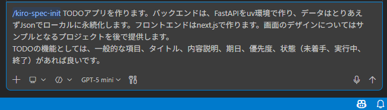
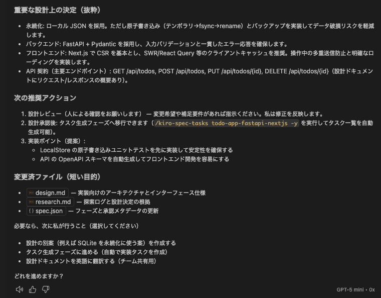
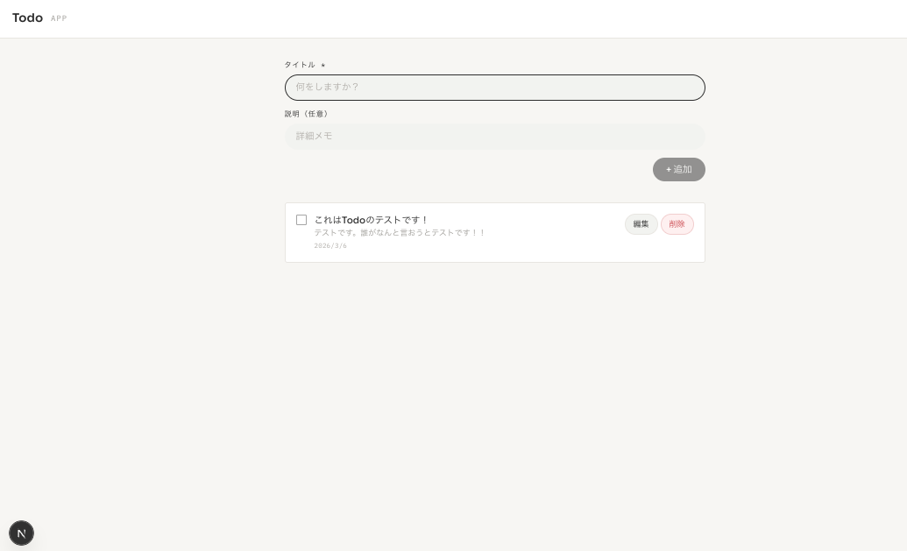
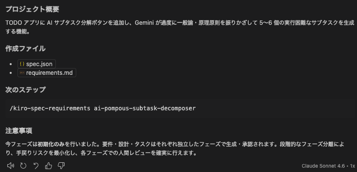
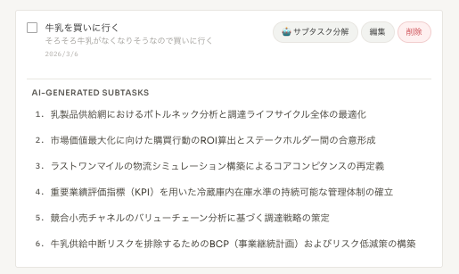

# GitHub Copilot で cc-sdd を試したら、ちゃんと動いた上に「牛乳を買いに行く」が国家的プロジェクトになった

## はじめに

[cc-sdd](https://github.com/gotalab/cc-sdd) をご存知だろうか。「Copilot Coding - Spec Driven Development」の略で、仕様駆動開発のワークフローを AI エージェントに組み込むためのツールだ。Claude Code 向けのドキュメントを目にすることが多いが、GitHub Copilot でも動作するという。

本記事では、GitHub Copilot に cc-sdd を導入し、FastAPI + Next.js の TODO アプリを構築した過程を報告する。なお、後半ではこのアプリに「AI サブタスク分解機能」を追加するが、その機能の実用性については読者自身が判断されたい。

---

## 第一幕：cc-sdd のセットアップと、シンプルな TODO アプリの構築

### cc-sdd のインストール

公式 README に従い、以下のコマンドを実行するだけだ。

```bash
npx cc-sdd@latest --copilot --lang ja   # GitHub Copilot 向け
```

これだけで `.kiro/` ディレクトリ配下に設定ファイルと各種テンプレートが展開される。Claude Code 専用というわけではなく、GitHub Copilot でも問題なく動作した。

### 仕様の起票（`/kiro-spec-init`）

Copilot のチャット欄に `/kiro-spec-init` を実行し、以下のような自然言語で要件を伝える。

> TODOアプリを作ります。バックエンドは、FastAPIをuv環境で作り、データはとりあえずJsonでローカルに永続化します。フロントエンドはnext.jsで作ります。画面のデザインについてはサンプルとなるプロジェクトを後で提供します。
> TODOの機能としては、一般的な項目、タイトル、内容説明、期日、優先度、状態（未着手、実行中、終了）があれば良いです。



ここで注目すべき点がある。**モデルに GPT-5 mini を使用している**。プレミアムリクエストを消費しない通常モデルだ。GitHub Copilot の定額プランの範囲内で、cc-sdd の仕様起票フローが動作することを確認できた。

### 設計フェーズ（`/kiro-spec-design`）

`/kiro-spec-design` を実行すると、GPT-5 mini が仕様を読み込み、アーキテクチャ上の重要な決定を提示する。



出力内容を抜粋する。

- **永続化**: ローカル JSON を採用。原子書き込み（テンポラリ→fsync→rename）とバックアップを実装してデータ破損リスクを軽減
- **バックエンド**: FastAPI + Pydantic を採用し、入力バリデーションと一貫したエラー応答を確保
- **フロントエンド**: Next.js で CSR を基本とし、SWR/React Query 等のクライアントキャッシュを推奨
- **API 契約**: `GET /api/todos`、`POST /api/todos`、`PUT /api/todos/{id}`、`DELETE /api/todos/{id}`

この精度であれば、設計レビューにそのまま使えるレベルだ。

### 生成されたアプリケーション

cc-sdd の仕様・設計・タスクの各フェーズを経て実装を進めた結果、以下の TODO アプリが完成した。



技術スタックは以下の通りである。

| レイヤー | 技術 |
|---------|------|
| フロントエンド | Next.js 16 (App Router), TypeScript, Tailwind CSS v4 |
| データフェッチ | SWR v2 |
| バックエンド | FastAPI + Pydantic v2 (Python 3.11+) |
| 永続化 | ローカル JSON（原子書き込み + `.bak` バックアップ） |
| テスト | pytest 51 件（後に 105 件に拡張） |

**ポイント**: このフェーズは GPT-5 mini のみで完結している。シンプルな CRUD アプリであれば、プレミアムリクエストを使わずとも cc-sdd のワークフローを十分に活用できる。

---

## 第二幕：AI サブタスク分解機能の追加

ここからが本題である。

TODO アプリとして機能的には完成しているが、物足りない。もう一歩進んで、**LangChain + Gemini を活用した AI 機能を追加**することにした。

### 機能の概要

機能名：**AI 大仰サブタスク分解機能（ai-pompous-subtask-decomposer）**

仕様のプロジェクト概要には次のように書かれている。

> TODO アプリに AI サブタスク分解ボタンを追加し、Gemini が過度に一般論・原理原則を振りかざして 5〜6 個の実行困難なサブタスクを生成する機能。



要件定義（`.kiro/specs/ai-pompous-subtask-decomposer/requirements.md`）には、こう記されている。

> **Requirement 2: 大仰プロンプト戦略**
> ユーザーとして、日常的な TODO に対して仰々しいコンサルティング用語・PMBOKフレームワーク・費用対効果分析などを含むサブタスクを受け取りたい。そうすることで、**どんな些細なタスクも壮大なプロジェクトとして楽しめる**。

### 実装のポイント

cc-sdd の設計フェーズでは、この大仰機能に対しても真剣に設計ドキュメントが生成される。

**バックエンドのシステムプロンプト骨子**（`subtask_service.py` 内の定数として定義）:

```
あなたは世界最高峰のビジネスコンサルタントです。
いかなる些細なタスクも、PMBOK・ROI・ステークホルダー分析・競合分析・
サプライチェーンリスク管理・変革管理フレームワークなどを駆使して
国際的・組織的・哲学的な重大課題として昇華させてください。
TODO のタイトルと説明を受け取り、5〜6 個の大仰なサブタスクを生成してください。
```

**追加した API エンドポイント**:

```
POST /api/todos/{id}/subtasks
```

レスポンス例:

```json
{
  "subtasks": [
    { "title": "ステークホルダーマップ作成：関係者影響度マトリクスの策定と合意形成プロセスの確立" },
    { "title": "ROI 試算：投資回収期間の算定とNPV/IRRに基づく財務モデリング" }
  ]
}
```

**フロントエンド**では、各 TodoCard に「🤖 サブタスク分解」ボタンを追加し、`useGenerateSubtasks` カスタムフックが API を呼び出す。ローディング中の多重クリック防止や、エラー表示なども既存のフックパターンに倣い実装されている。

### 実行結果

「牛乳を買いに行く」という TODO に対して「🤖 サブタスク分解」ボタンを押した結果がこちらである。



生成されたサブタスク（原文ママ）:

1. 乳製品供給網におけるボトルネック分析と調達ライフサイクル全体の最適化
2. 市場価値最大化に向けた購買行動のROI算出とステークホルダー間の合意形成
3. ラストワンマイルの物流シミュレーション構築によるコアコンピタンスの再定義
4. 重要業績評価指標（KPI）を用いた冷蔵庫内在庫水準の持続可能な管理体制の確立
5. 競合小売チャネルのバリューチェーン分析に基づく調達戦略の策定
6. 牛乳供給中断リスクを排除するためのBCP（事業継続計画）およびリスク低減策の構築

スーパーへの道すがら「コアコンピタンスの再定義」を行い、帰宅後は「BCP の策定」に取り掛かる必要があるようだ。

なお、このサブタスクは**永続化されない**。表示されるのみである。設計ドキュメントの Non-Goals にも「サブタスクのサーバー側永続化は本フェーズのスコープ外」と明記されている。壮大なサブタスクが生成されるが、画面を閉じると消える。ある意味、現実的な設計判断と言えるかもしれない。

---

## まとめ

本記事を通じて確認できた事項を整理する。

### cc-sdd on GitHub Copilot の実用性

| 観点 | 結果 |
|------|------|
| インストールの容易さ | `npx` 一発で完了。問題なし |
| GPT-5 mini での仕様起票 | 十分実用的。定額プランの範囲内で動作 |
| 設計ドキュメントの品質 | アーキテクチャの論点を適切に整理 |
| タスク生成〜実装への誘導 | フェーズ分離により段階的に進められる |
| テスト生成 | 最終的に pytest 105 件・Playwright 13 件が自動生成 |

**結論**: GitHub Copilot でも cc-sdd は十分に動作する。シンプルなアプリ開発であれば、プレミアムモデルを使わずとも仕様・設計・タスクの各フェーズを回せることが確認できた。

### AI 大仰サブタスク分解機能の実用性

**結論**: ない。

ただし、「些細な日常タスクを壮大なプロジェクトに昇華させる」という要件定義に対して、Gemini は完璧に要件を満たしている。要件定義の書き方次第でAIは誠実に実装する、という教訓は得られた。

---

## 参考リンク

- [cc-sdd GitHub リポジトリ](https://github.com/gotalab/cc-sdd)
- [cc-sdd README (日本語)](https://github.com/gotalab/cc-sdd/blob/main/tools/cc-sdd/README_ja.md)
- [本記事のサンプルリポジトリ](https://github.com/tis-abe-akira/todo-master)
